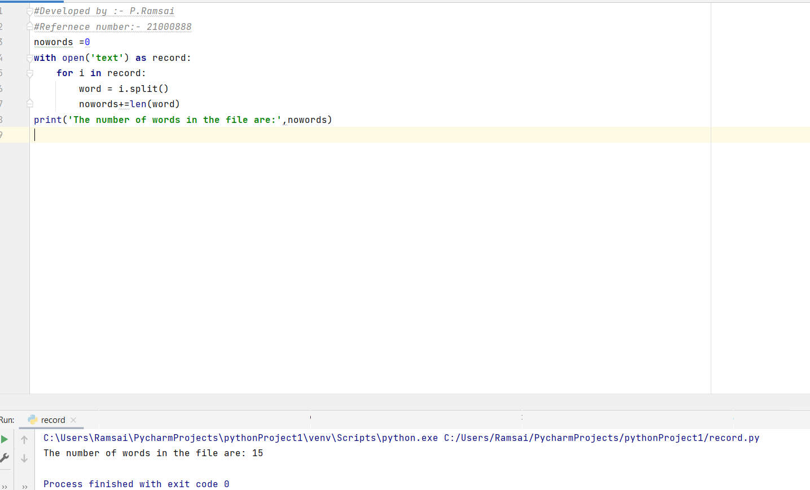
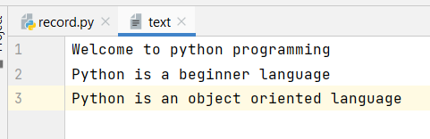

# Word-count
## AIM:
To write a python program for getting the word count from a textfile.
## EQUIPEMENT'S REQUIRED: 
PC
Anaconda - Python 3.7
## ALGORITHM: 
### Step 1:
Start
### Step 2: 
Declare a variable noword equal to 0. 
### Step 3: 
Open the requried text file in read mode as text.(any name can be used).
### Step 4:  
Loop until variable i in file text.
### Step 5: 
Declare variable word = i.split().
### Step 6: 
Process nowards+=len(word)
End loop
### step 7:
print the value of nowrds,which has the number of words in the file.
## PROGRAM:
```
~~~
#Developed by :- P.Ramsai
#Refernece number:- 21000888
~~~
nowords =0
with open('text') as record:
    for i in record:
        word = i.split()
        nowords+=len(word)
print('The number of words in the file are:',nowords)
```


### OUTPUT:





## RESULT:
Thus the program is written to find the word count from a text.
